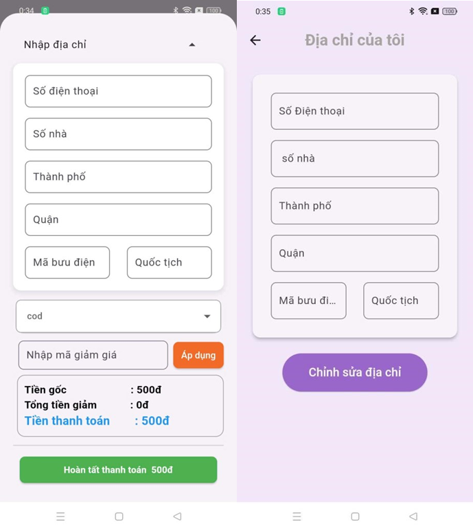
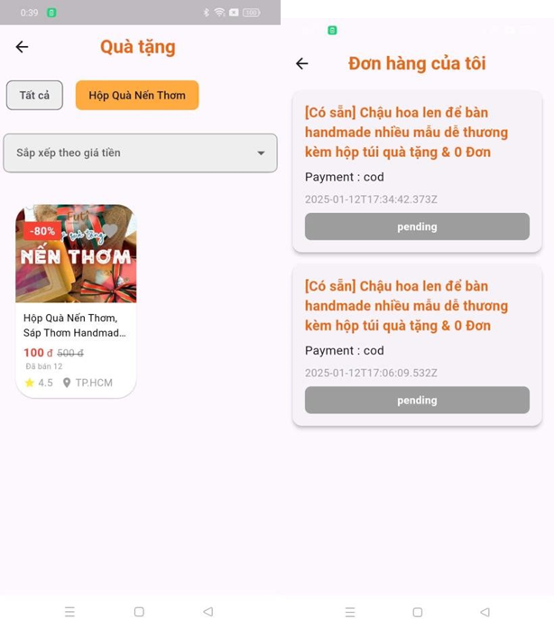
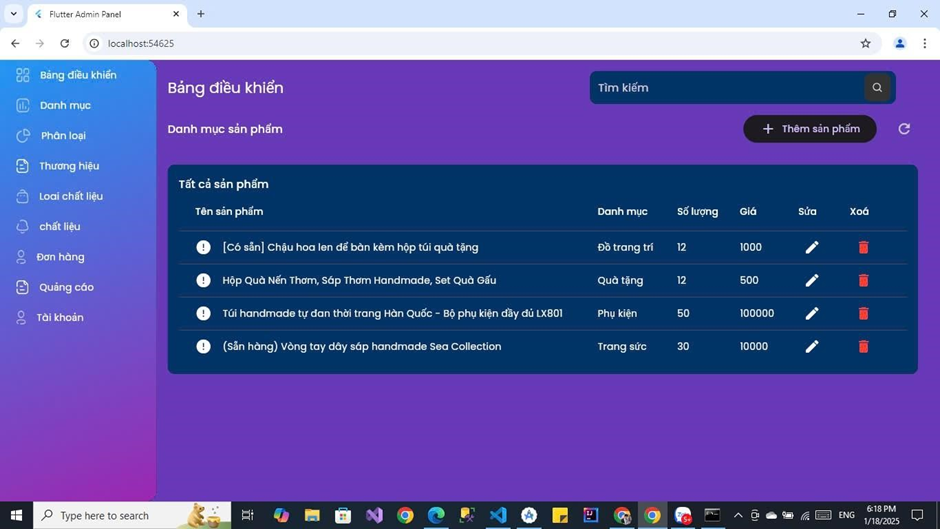

# Handmade Shop - Ứng Dụng Bán Đồ Handmade:

## 🛍️ Giới Thiệu
Handmade Shop là ứng dụng thương mại điện tử giúp kết nối những người yêu thích đồ thủ công với các nghệ nhân. Ứng dụng cung cấp một nền tảng hiện đại, dễ sử dụng để mua sắm các sản phẩm handmade chất lượng cao.

## 🌟 Tính Năng Chính
- 🏪 **Trang chủ:** Hiển thị danh sách sản phẩm handmade mới nhất và phổ biến nhất.
- 🔍 **Tìm kiếm & Bộ lọc:** Dễ dàng tìm kiếm sản phẩm theo danh mục, giá cả, đánh giá.
- 🛒 **Giỏ hàng & Thanh toán:** Thêm sản phẩm vào giỏ hàng, hỗ trợ thanh toán qua nhiều phương thức.
- ❤️ **Danh sách yêu thích:** Lưu lại sản phẩm yêu thích để mua sau.
- 💬 **Đánh giá & Nhận xét:** Người dùng có thể đánh giá và bình luận về sản phẩm.
- 📦 **Quản lý đơn hàng:** Theo dõi trạng thái đơn hàng theo thời gian thực.
- 👤 **Hồ sơ cá nhân:** Quản lý thông tin cá nhân, địa chỉ giao hàng.

## 🏗️ Công Nghệ Sử Dụng
- **Flutter** (Dart) - Framework chính để phát triển ứng dụng.
- **Firebase** - Lưu trữ dữ liệu, xác thực người dùng, và gửi thông báo.
- **SQLite** - Lưu trữ dữ liệu offline.
- **Provider / Riverpod** - Quản lý trạng thái ứng dụng.

## 📸 Hình Ảnh Demo
📷 **[Thêm hình ảnh demo của ứng dụng tại đây]**

## 📌 Hướng Dẫn Cài Đặt
1. **Clone repo:**
   ```bash
   git clone https://github.com/yourusername/handmade-shop.git
   cd handmade-shop
   ```
2. **Cài đặt dependencies:**
   ```bash
   flutter pub get
   ```
3. **Chạy ứng dụng:**
   ```bash
   flutter run
   ```

## 🚀 Đóng Góp & Phát Triển
Chúng tôi luôn hoan nghênh các ý tưởng và đóng góp mới. Nếu bạn muốn tham gia phát triển, vui lòng gửi Pull Request hoặc mở Issue trên GitHub.

📧 Liên hệ: [Huy090603huy@gmail.com]

# 💻Tech Stack
  	    


### 💻DEMO
## 🚀 Trang Chủ

## 🚀 Trang thông tin

## 🚀 Gio hàng

## 🚀 Địa chi và thanh toán 

## 🚀 Theo dõi đơn hàng và lọc giá 

## 🚀 Trang ADMIN


